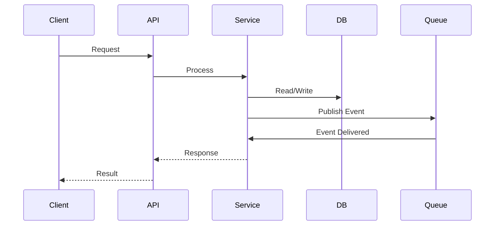

# Integration Specification

## API Contracts

### REST API

#### Authentication
```
Authorization: Bearer {jwt_token}
X-API-Key: {api_key}
```

### GraphQL API

Available for complex queries and batched operations.

## Event Schemas

### Event Message Format

All events follow this standard envelope:

```json
{
  "event_id": "uuid",
  "event_type": "resource.action",
  "timestamp": "2026-02-11T08:00:00Z",
  "source": "system-name",
  "version": "1.0",
  "correlation_id": "uuid",
  "user_id": "uuid",
  "payload": {
    // Event-specific data
  }
}
```

## Data Flow Diagrams

### Main Flow



## Error Handling

### Standard Error Response

```json
{
  "error": {
    "code": "ERROR_CODE",
    "message": "Human readable message",
    "details": {},
    "request_id": "uuid",
    "timestamp": "2026-02-11T08:00:00Z"
  }
}
```

### Error Codes

| Code | HTTP Status | Description |
|------|-------------|-------------|
| VALIDATION_ERROR | 400 | Invalid request data |
| UNAUTHORIZED | 401 | Missing/invalid auth |
| FORBIDDEN | 403 | Insufficient permissions |
| NOT_FOUND | 404 | Resource not found |
| RATE_LIMIT_EXCEEDED | 429 | Too many requests |
| INTERNAL_ERROR | 500 | Server error |

## Rate Limiting

```
X-RateLimit-Limit: 1000
X-RateLimit-Remaining: 987
X-RateLimit-Reset: 1707638400
```

- **Per-User Limit**: 1000 requests/minute
- **Burst Limit**: 50 requests/second
- **Global Limit**: 100,000 requests/minute
