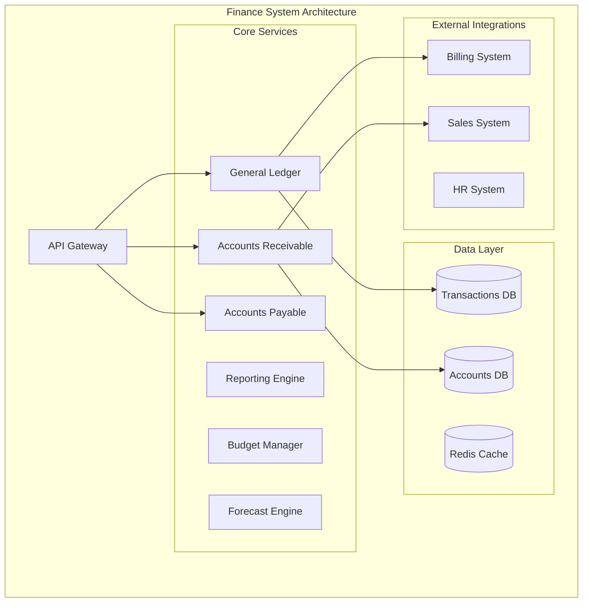

# Financial Planning and Analysis

## Overview

The Financial Planning and Analysis is a comprehensive financial management platform for accounting, reporting, budgeting, and forecasting.

## Purpose and Capabilities

- **General Ledger**: Chart of accounts, journal entries, and account reconciliation
- **Accounts Receivable**: Invoice tracking, payment collection, and aging reports
- **Accounts Payable**: Vendor management, bill payment, and expense tracking
- **Financial Reporting**: P&L, balance sheet, cash flow, and custom reports
- **Budgeting**: Budget creation, allocation, variance analysis, and approvals
- **Forecasting**: Revenue and expense projections with scenario modeling
- **Compliance**: SOX controls, audit trails, and regulatory reporting

## Architecture Diagram



## Tech Stack

### Backend
- **Runtime**: Node.js 20 LTS
- **Framework**: Express.js with TypeScript
- **API**: RESTful + GraphQL
- **Authentication**: JWT with OAuth2.0

### Data Storage
- **Primary Database**: PostgreSQL 15
- **Analytics**: ClickHouse
- **Cache**: Redis 7

### Infrastructure
- **Container Orchestration**: Kubernetes
- **Message Queue**: RabbitMQ

## Integration Points

### Upstream Dependencies
- **Billing System**: Revenue transactions, payment receipts, refunds
- **Sales System**: Revenue forecasts, commission expenses, sales metrics
- **HR System**: Payroll expenses, benefits costs, headcount data
- **Operations**: Infrastructure costs, vendor invoices, operational expenses

### Downstream Consumers
- **Executive Dashboard**: Financial metrics, KPIs, and performance indicators
- **HR System**: Budget approvals for hiring and compensation
- **Sales System**: Commission statements, territory budgets

## Quick Start

```bash
git clone https://github.com/ionoi-inc/finance-system-architect.git
cd finance-system-architect
npm install
cp .env.example .env
npm run migrate
npm run dev
```

## Performance Benchmarks

- Transaction posting: <100ms (p95)
- Report generation: <2s (p95)
- Account balance: <50ms (p95)

## Security

- SOX compliance
- Role-based access control
- Audit trails
- Data encryption
- Multi-approval workflows

## License

Proprietary - ionoi-inc
